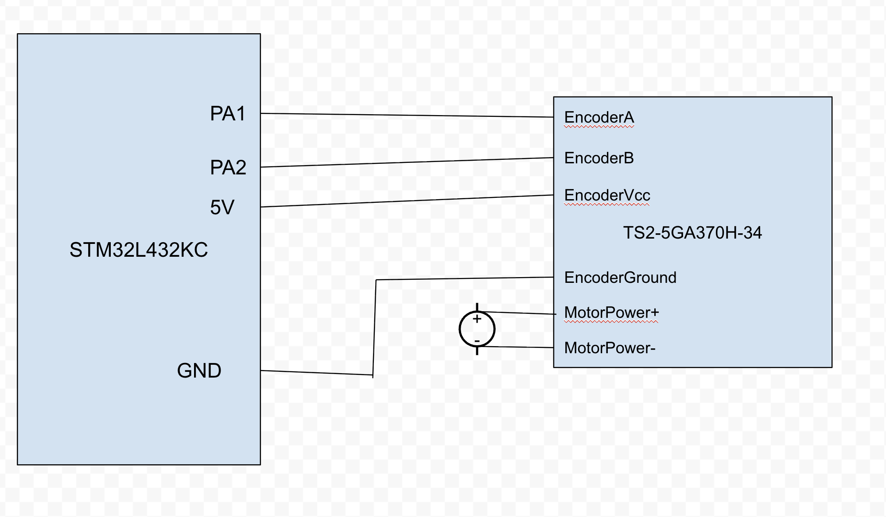
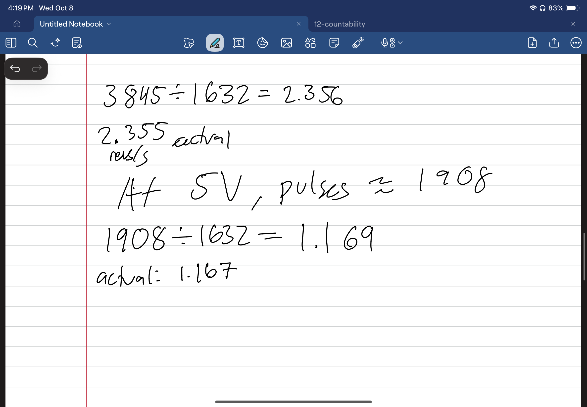
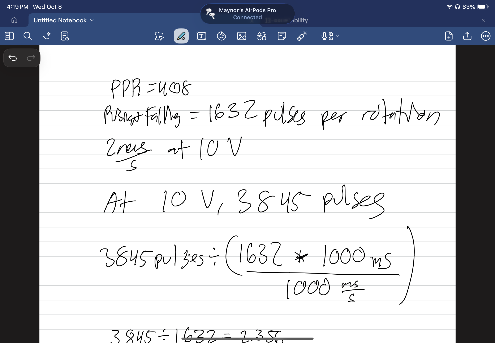

## Lab 5: Interrupts

## Introduction
In this lab, we were to utilize external intruupts generated by a pulse from a motor to a microcontrolleer to calculate the velocity of the motor. 

## Design
Starting off, we needed two intruppts. I linked them to PA pins that were 5V tolerable as the motor used 5V logic. From there, I decided to enable the intruupts based on rising and falling edge to get the best resolution to help calculate the velocity. We count every intrupt we get, but the important part was figuring out which way it was currently rotating. 
To start I assumed it would has not changed direction, setting it to 0. To detect if it changed direction, it would 'or' direction variable with the last ouklse generated. Last Pulse is first initated by getting the currecnt edges, it would 'xor' the two values given, providing a 1 if it were PA1 and a 0 if it were PA2. 
Back to direction, this is specific to intrupt on PA1: if it sees a 0 and direction 0, it would say the direction is fine and set the last pin variable as 1. 

Now for inturupt 2: It does the same thing, except it 'nots' the result. This is due to PA2 being based off being 0. 

To generate pulses, we do 1 - 2*direction, as if we did change direction, it should subtract rather than add. 

After getting the counts done, we now move onto the final division. I have TMR2 set up with 1ms ticks and have it send an overflow interupt when it hits 1 second, which is 1Hz to update the rev per second. Note that TMR2 can be adjusted to indicate overflow by adjusting its ARR to be ARR = (DesiredSampleRateMS - 1). 

# Technical Documentation:
The source code can be found here: [LAB5](https://github.com/MaynorB/lab5)

## Schematic 
The following shcematic is my wiring for this lab
{fig-align="center"}

# Conclusion
It did end up working. However, very very rarely it would swap directions for 1-4 updates before correcting itself. This could be likly due to the intrupts taking a bit longer than I hope or at worse it missed a pulse, which still links to an intrupt not being cleared fast enough. But for now, it works fine. Here is some calculations to showcase our accuracy.
{fig-align="left"}
{fig-align="right"}

## AI Prototype Summary

I plugged the prompt into ChatGPT, it provided me with two solutions: a Timer in Encoder mode and External inturrupts on GPIOs. I am going to specifically talk about the external inturrpts. It recommened me to use PA0 and PA1 as they are directly mapped to channels on Timer2 allowing for future upgrades into encoder mode. It provided some code, but when prompted furthur, the code it provided just simply didn't run. It makes sense it why it explained PA0 and PA1. I believe it makes a good starting point but not a great tool to fully complete the lab as it does mix a few things up. 